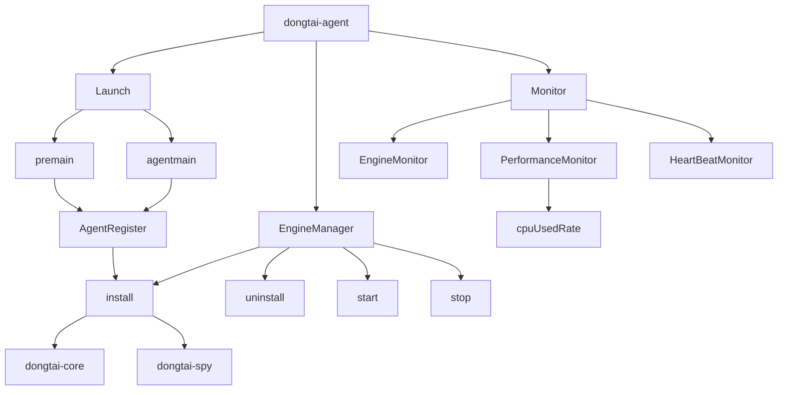
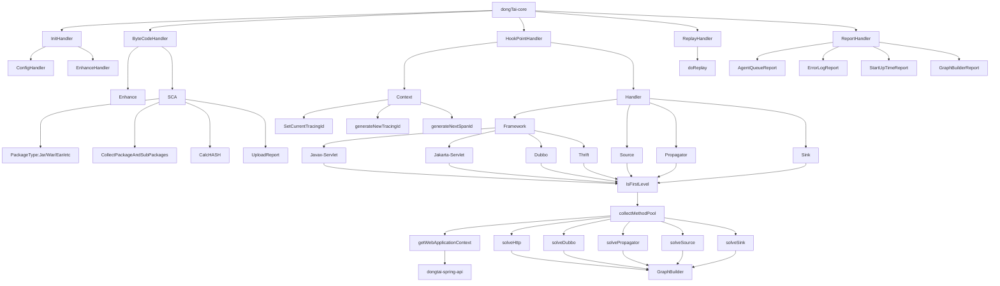
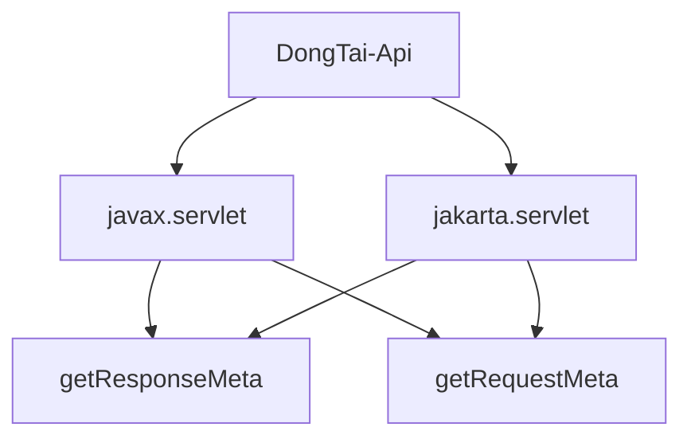
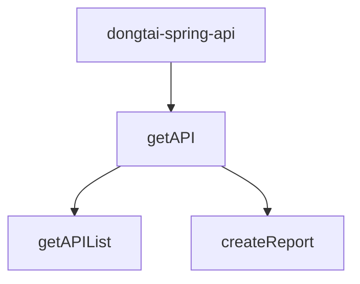

# Agent 架构

DongTai Java Agent 工作流：


DongTai Java Agent 由 dongTai-agent、dongtai-api、dongTai-core、dongtai-log、dongtai-spring-api、dongtai-spy 组成。

dongTai-agent：agent 模块，用于管理 Agent 的生命周期

dongtai-api：servlet 模块，用于获取请求体和响应体

dongTai-core：引擎模块，用于收集、上报信息

dongtai-log：日志模块，为其他模块提供日志打印输出

dongtai-spring-api：Spring API 模块，用于获取 Spring 应用的 API Sitemap 

dongtai-spy ：间谍模块，将间谍类加载入 BootstrapClassLoader， 信息收集入口

## dongtai-agent

1. Agent 加载
2. Agent 配置
3. Agent 生命周期
4. Agent 注册
5. Agent 心跳
6. Agent 阈值




#### Agent 加载

- 启动时加载

  “premain 方式加载”就是在添加 DongTai Java Agent 的 Java 应用 ***启动时*** 加载 Agent。添加 JVM 参数 -javaagent 的方式加载。

  ```
  java -javaagent:{AGENT_PATH}/agent.jar -jar app.jar
  ```

  `code：com.secnium.iast.agent.AgentLauncher#premain`

- 运行时加载

  “agentmain 方式加载”是在添加 DongTai Java Agent 的 Java 应用 ***运行时*** 加载 Agent。通过 Attach 的方式加载。

  ```
  java -jar {AGENT_PATH}/agent.jar -m install -p {JAVA_APP_PID}
  ```

  `code：com.secnium.iast.agent.AgentLauncher#agentmain & com.secnium.iast.agent.Agent#main`

#### Agent 配置

- Agent 的配置文件 iast.properties 如下：

  ```
  iast.name=dongtai-Enterprise 1.3.0
  iast.response.name=dongtai
  iast.response.value=1.3.0
  iast.server.url=
  iast.server.token=
  iast.allhook.enable=false
  iast.dump.class.enable=false
  iast.dump.class.path=/tmp/iast-class-dump/
  iast.service.report.interval=6000
  app.name=DongTai
  engine.name=java.action.github.com
  engine.status=start
  jdk.version=1
  project.name=ExampleApplication
  project.create=
  project.version=
  iast.proxy.enable=false
  iast.proxy.host=
  iast.proxy.port=
  response.length=
  iast.server.mode=local
  ```

  配置文件各字段的含义请查看 [配置参数]()
  
  `code:dongtai-agent/src/main/resources/iast.properties`

#### Agent 生命周期

- 下载、安装、启动、停止、重启、卸载

  `code:com.secnium.iast.agent.manager.EngineManager`

#### Agent 注册

- Agent 在启动时会向 Dongtai OpenAPI 服务注册

  `code:com.secnium.iast.agent.report.AgentRegisterReport`

#### Agent 心跳

- Agent 每分钟向 Dongtai OpenAPI 服务发送心跳数据，若 Dongtai OpenAPI 服务2分钟未收到心跳，则 Agent 被判定为停止

  `code:com.secnium.iast.agent.report.HeartBeatReport & com.secnium.iast.agent.monitor.HeartBeatMonitor`

#### Agent 阈值

- Agent 对应用服务器的 CPU 使用率进行监控，当 CPU 使用率到达洞态 Server 端设置的阈值时，Agent 会停止

  `code:com.secnium.iast.agent.monitor.PerformanceMonitor`

## dongTai-core

1. 获取规则
2. 字节码转换
3. 第三方组件获取
4. 方法调用链
5. 请求重放（主动验证）
6. 信息上报



#### 获取规则

- 每次启动时，Agent 从 DongTai OpenAPI 服务动态的拉取最新规则

  `code:com.secnium.iast.core.engines.impl.ConfigEngine#start`

#### 字节码转换

- Agent 会根据拉取的规则和已定义的规则策略对某些类的字节码进行转换

  `code:com.secnium.iast.core.engines.impl.TransformEngine#start`

#### 第三方组件获取

- Agent 目前对以下启动方式进行组件获取：

  - jar 文件启动：在 jar 文件内部存在文件夹`BOOT-INF`，放置了该 jar 文件使用的所有第三方组件
  - war 文件启动：在 war 文件内部存在文件夹`WEB-INF`，放置了该 war 文件使用的所有第三方组件
  - 设置参数 -classpath 启动：启动时设置 -classpath 参数，该参数会将所依赖的第三方组件的目录标明

  `code:com.secnium.iast.core.enhance.sca.ScaScanner#scanForSCA`

#### 方法调用链

- 节点生成

  `code:com.secnium.iast.core.handler.SpyDispatcherImpl#collectMethodPool`

- 构建方法调用链

  `code:com.secnium.iast.core.handler.graphy.GraphBuilder#build`

#### 请求重放（主动验证）

- 请求重放功能会将 DongTai OpenAPI 服务发送过来的请求信息在 Agent 内部进行请求

  `code:com.secnium.iast.core.replay.HttpRequestReplay`

#### 信息上报

- Agent 会将收集到的信息上报至 DongTai OpenAPI 服务：

  - 第三方组件

  - 方法调用链

  - Agent 启动时间

  - API 导航

  - 异常

  `code:com.secnium.iast.core.report`

## dongtai-spy

1. 间谍类

```mermaid
graph TD;
	dongtai-spy-->SpyDispatcher;
	SpyDispatcher-->enterHttp;
	enterHttp-->dongtai-core;
	SpyDispatcher-->leaveHttp;
	leaveHttp-->dongtai-core;
	SpyDispatcher-->isFirstLevelHttp;
	isFirstLevelHttp-->dongtai-core;
	SpyDispatcher-->cloneRequest;
	cloneRequest-->dongtai-core;
	cloneRequest-->dongtai-api
	SpyDispatcher-->cloneResponse;
	cloneResponse-->dongtai-core;
	cloneResponse-->dongtai-api
	SpyDispatcher-->enterDubbo;
	enterDubbo-->dongtai-core;
	SpyDispatcher-->leaveDubbo;
	leaveDubbo-->dongtai-core;
	SpyDispatcher-->isFirstLevelDubbo;
	isFirstLevelDubbo-->dongtai-core;
	SpyDispatcher-->enterSource;
	enterSource-->dongtai-core;
	SpyDispatcher-->leaveSource;
	leaveSource-->dongtai-core;
	SpyDispatcher-->isFirstLevelSource
	isFirstLevelSource-->dongtai-core;
	SpyDispatcher-->enterPropagator
	enterPropagator-->dongtai-core;
	SpyDispatcher-->leavePropagator
	leavePropagator-->dongtai-core;
	SpyDispatcher-->isFirstLevelPropagator
	isFirstLevelPropagator-->dongtai-core;
	SpyDispatcher-->enterSink
	enterSink-->dongtai-core;
	SpyDispatcher-->leaveSink
	leaveSink-->dongtai-core;
	SpyDispatcher-->isFirstLevelSink
	isFirstLevelSink-->dongtai-core;
	SpyDispatcher-->collectMethodPool
	collectMethodPool-->dongtai-core;
	dongtai-core-->SpyDispatcherImpl;
```




#### 间谍类

- 当某些类被 Agent 进行字节码转换后，Agent 会收集这些类的具体方法或者对象的信息，间谍类就是收集这些信息的入口。

  `code:java.lang.dongtai.SpyDispatcher`

## dongtai-api

1. 支持 javax.servlet 和 jakarta.servlet
2. 获取请求体和响应体




#### 支持 javax.servlet 和 jakarta.servlet

- 在 Tomcat 10 之前，Tomcat 使用的包名为 `javax.*`；在 Tomcat 10 时，Tomcat 使用的包名为 `jakarta.*` 

  `code:io/dongtai/api/jakarta & io/dongtai/api/servlet2`

#### 获取请求体和响应体

- servlet2

  `code:io.dongtai.api.servlet2.ServletRequestWrapper#getRequestMeta & io.dongtai.api.servlet2.ServletResponseWrapper#getResponseMeta`

- Jakarta

  `code:io.dongtai.api.jakarta.JakartaRequestWrapper#getRequestMeta & io.dongtai.api.jakarta.JakartaResponseWrapper#getResponseMeta `

## dongtai-spring-api

1. 获取 Spring 应用的所有接口信息




#### 获取 Spring 应用的所有接口信息

- 通过获取 Spring 应用的上下文来收集到应用的所有接口信息

  `code:cn.huoxian.iast.spring.SpringApplicationContext`

## dongtai-log

1. 日志输出
2. 日志配置

#### 日志输出

- dongtai-log 负责 Agent 各个模块的日志输出

  `code:com.secnium.iast.log.DongTaiLog` 

#### 日志配置

- 配置参数有日志输出等级、是否将日志输出到文件、输出文件位置

  `code:com.secnium.iast.log.IastProperties`